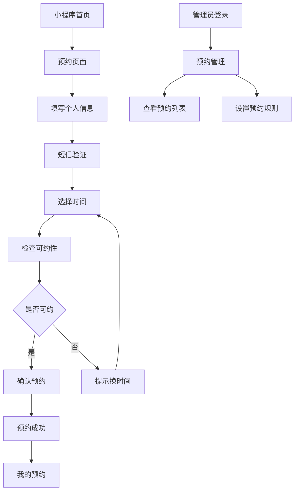

## 1. 产品概述
博物馆预约微信小程序，为用户提供便捷的博物馆参观预约服务，同时为管理员提供预约管理后台。
- 解决用户现场排队购票问题，提供线上预约服务
- 面向博物馆参观者和场馆管理人员
- 通过微信小程序生态，提供轻量级预约体验

## 2. 核心功能

### 2.1 用户角色
| 角色 | 注册方式 | 核心权限 |
|------|----------|----------|
| 普通用户 | 微信授权登录 | 浏览博物馆信息、预约参观、查看预约记录 |
| 管理员 | 后台账号登录 | 查看预约列表、设置预约规则、管理场馆信息 |

### 2.2 功能模块
小程序端包含以下主要页面：
1. **首页**：博物馆介绍、图片轮播、预约入口
2. **预约页面**：预约表单、时间选择、短信验证
3. **我的预约**：预约记录、预约详情
4. **个人中心**：用户信息、联系客服

管理后台包含以下主要页面：
1. **预约管理**：预约列表、预约详情、预约统计
2. **系统设置**：预约规则配置、场馆信息管理
3. **用户管理**：管理员账号管理

### 2.3 页面详情
| 页面名称 | 模块名称 | 功能描述 |
|-----------|-------------|-------------|
| 小程序首页 | 博物馆介绍 | 展示博物馆基本信息、开放时间、地址等 |
| 小程序首页 | 图片轮播 | 轮播展示博物馆内部环境、展品图片 |
| 小程序首页 | 预约入口 | 跳转到预约页面的按钮 |
| 预约页面 | 预约表单 | 填写姓名、手机号、身份证号 |
| 预约页面 | 短信验证 | 发送验证码、验证手机号真实性 |
| 预约页面 | 时间选择 | 选择预约日期和时间段（10:00-15:00，每小时一个时段） |
| 预约页面 | 可约性检查 | 实时检查所选时间段是否可约 |
| 我的预约 | 预约列表 | 展示用户所有预约记录 |
| 我的预约 | 预约详情 | 查看单个预约的详细信息 |
| 管理后台-预约管理 | 预约列表 | 展示所有用户预约信息 |
| 管理后台-预约管理 | 预约统计 | 按日期统计预约数量 |
| 管理后台-系统设置 | 预约规则 | 设置每小时最大预约人数 |
| 管理后台-系统设置 | 场馆信息 | 编辑博物馆基本信息 |

## 3. 核心流程

### 用户预约流程
1. 用户进入小程序首页，浏览博物馆信息
2. 点击预约按钮，进入预约页面
3. 填写个人信息（姓名、手机号、身份证号）
4. 获取并输入短信验证码
5. 选择预约日期和时间段
6. 系统检查时间段可约性
7. 确认预约信息并提交
8. 预约成功，生成预约记录

### 管理员操作流程
1. 管理员登录后台系统
2. 查看预约管理列表，了解预约情况
3. 根据需要调整每小时最大预约人数
4. 查看预约统计数据，分析客流趋势

## 4. 用户界面设计

### 4.1 设计风格
- **主色调**：深棕色（#8B4513）体现博物馆的文化底蕴
- **辅助色**：米白色（#F5F5DC）营造温馨感
- **按钮样式**：圆角矩形，轻微阴影效果
- **字体**：苹方字体，标题18px，正文14px
- **布局风格**：卡片式布局，清晰的信息层级
- **图标风格**：线性图标，简洁现代

### 4.2 页面设计概述
| 页面名称 | 模块名称 | UI元素 |
|-----------|-------------|-------------|
| 小程序首页 | 博物馆介绍 | 顶部轮播图（高度200px），下方文字介绍区域，使用卡片式布局 |
| 小程序首页 | 预约入口 | 底部固定按钮，深棕色背景，白色文字，圆角设计 |
| 预约页面 | 预约表单 | 分组输入框，带图标提示，实时验证输入格式 |
| 预约页面 | 时间选择 | 日期选择器+时间段网格，可约时间段绿色显示，已满时间段灰色显示 |
| 我的预约 | 预约列表 | 时间轴式布局，按时间倒序排列，显示预约状态 |
| 管理后台 | 预约列表 | 表格形式展示，支持筛选和导出功能 |

### 4.3 响应式设计
- 小程序端：适配各种手机屏幕尺寸
- 管理后台：桌面端优先，支持平板自适应
- 触摸交互优化：按钮点击区域不小于44px

### 4.4 扩展功能规划
- **文创商城**：展示文创产品图片和介绍，支持在线购买
- **活动预约**：展示博物馆活动信息，支持活动预约
- **导览服务**：提供语音导览和路线推荐