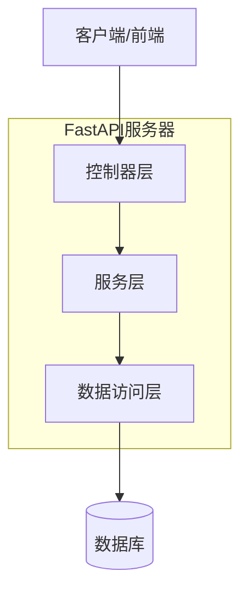
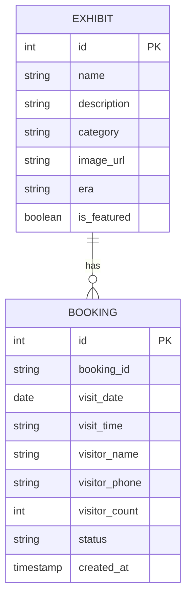

## 1.架构设计

```mermaid
graph TD
    A[用户小程序端] --> B[Vue 3 Admin管理端]
    A --> C[FastAPI后端服务]
    C --> D[SQLite(开发)/PostgreSQL(生产)]
    C --> E[SQLAlchemy ORM]
    B --> C

    subgraph "前端层"
        A
        B
    end

    subgraph "服务层"
        C
        E
    end

    subgraph "数据层"
        D
    end
```

## 2.技术描述

* **小程序前端**: Uni-app(Vue 3) + uView UI

* **管理端前端**: Vue 3 + Vite + Element Plus

* **初始化工具**: Vite-init(管理端)

* **后端**: Python + FastAPI

* **数据库**: SQLite(开发环境) / PostgreSQL(生产环境)

* **ORM框架**: SQLAlchemy

## 3.路由定义

| 路由               | 用途                |
| ---------------- | ----------------- |
| /                | 小程序首页，展示电影艺术家故居介绍 |
| /booking         | 预约页面，选择参观时间       |
| /exhibits        | 展品页面，展示电影相关文物     |
| /admin/login     | 管理端登录页面           |
| /admin/dashboard | 管理端仪表盘            |
| /admin/exhibits  | 展品管理页面            |
| /admin/bookings  | 预约管理页面            |

## 4.API定义

### 4.1 核心API

展品相关API

```
GET /api/exhibits
```

请求参数:

| 参数名      | 参数类型    | 是否必需  | 描述                  |
| -------- | ------- | ----- | ------------------- |
| page     | integer | false | 页码，默认为1             |
| limit    | integer | false | 每页数量，默认为10          |
| category | string  | false | 展品类别(如：电影海报、剧本、道具等) |

响应:

| 参数名      | 参数类型    | 描述   |
| -------- | ------- | ---- |
| exhibits | array   | 展品列表 |
| total    | integer | 总数量  |
| page     | integer | 当前页码 |

示例:

```json
{
  "exhibits": [
    {
      "id": 1,
      "name": "经典电影海报",
      "description": "艺术家主演电影原版海报",
      "category": "电影海报",
      "image_url": "/images/posters/classic.jpg",
      "era": "1950年代"
    }
  ],
  "total": 50,
  "page": 1
}
```

预约相关API

```
POST /api/bookings
```

请求:

| 参数名            | 参数类型    | 是否必需 | 描述               |
| -------------- | ------- | ---- | ---------------- |
| visit\_date    | string  | true | 参观日期(YYYY-MM-DD) |
| visit\_time    | string  | true | 参观时间段            |
| visitor\_name  | string  | true | 访客姓名             |
| visitor\_phone | string  | true | 访客电话             |
| visitor\_count | integer | true | 访客人数             |

响应:

| 参数名         | 参数类型   | 描述   |
| ----------- | ------ | ---- |
| booking\_id | string | 预约ID |
| status      | string | 预约状态 |

示例:

```json
{
  "visit_date": "2024-02-15",
  "visit_time": "14:00-16:00",
  "visitor_name": "张三",
  "visitor_phone": "13800138000",
  "visitor_count": 2
}
```

## 5.服务器架构图



## 6.数据模型

### 6.1 数据模型定义



### 6.2 数据定义语言

展品表(exhibits)

```sql
-- 创建展品表
CREATE TABLE exhibits (
    id INTEGER PRIMARY KEY AUTOINCREMENT,
    name VARCHAR(255) NOT NULL,
    description TEXT,
    category VARCHAR(100) NOT NULL,
    image_url VARCHAR(500),
    era VARCHAR(100),
    is_featured BOOLEAN DEFAULT FALSE,
    created_at TIMESTAMP DEFAULT CURRENT_TIMESTAMP,
    updated_at TIMESTAMP DEFAULT CURRENT_TIMESTAMP
);

-- 创建索引
CREATE INDEX idx_exhibits_category ON exhibits(category);
CREATE INDEX idx_exhibits_featured ON exhibits(is_featured);

-- 初始化数据
INSERT INTO exhibits (name, description, category, image_url, era, is_featured) VALUES 
('《艺术家自传》手稿', '电影艺术家亲笔书写的自传手稿', '文献资料', '/images/documents/autograph.jpg', '1960年代', true),
('经典电影海报集', '艺术家主演电影的原版海报收藏', '电影海报', '/images/posters/collection.jpg', '1950-1970年代', true),
('电影道具展示', '艺术家使用过的电影拍摄道具', '道具', '/images/props/classic.jpg', '1970年代', false);
```

预约表(bookings)

```sql
-- 创建预约表
CREATE TABLE bookings (
    id INTEGER PRIMARY KEY AUTOINCREMENT,
    booking_id VARCHAR(50) UNIQUE NOT NULL,
    visit_date DATE NOT NULL,
    visit_time VARCHAR(50) NOT NULL,
    visitor_name VARCHAR(100) NOT NULL,
    visitor_phone VARCHAR(20) NOT NULL,
    visitor_count INTEGER NOT NULL,
    status VARCHAR(20) DEFAULT 'pending' CHECK (status IN ('pending', 'confirmed', 'cancelled')),
    created_at TIMESTAMP DEFAULT CURRENT_TIMESTAMP,
    updated_at TIMESTAMP DEFAULT CURRENT_TIMESTAMP
);

-- 创建索引
CREATE INDEX idx_bookings_date ON bookings(visit_date);
CREATE INDEX idx_bookings_status ON bookings(status);
```

